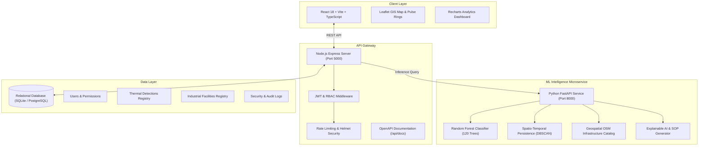

# PyroGuard AI: Industrial Fire & Persistent Thermal Source Detection Platform

[](https://github.com/)
[](https://opensource.org/licenses/MIT)
[](https://fastapi.tiangolo.com/)
[](https://expressjs.com/)
[](https://react.dev/)

> **Smart India Hackathon (SIH) 2026 Submission**
> **Theme**: Space Technology, Disaster Management & Critical Infrastructure Protection

---

## 1. Problem Statement
Industrial facilities—such as petroleum refineries, petrochemical complexes, thermal power stations, steel mills, mining basins, and offshore gas platforms—produce substantial thermal signatures observable by earth observation satellites. In addition, catastrophic industrial accidents, storage tank ruptures, and hazardous gas leaks pose immense threats to critical infrastructure, human life, and the environment.

While satellite-based monitoring systems such as **NASA FIRMS (VIIRS 375m & MODIS 1km)** detect thermal anomalies worldwide, they **do not distinguish** between:
1. **Acute Accidental Industrial Fires** (refinery tank fires, chemical explosions)
2. **Routine Operational Flaring** (stationary gas flaring stacks, blast furnace exhausts)
3. **Natural Wildfires** (forest, woodland, and brush fires)
4. **Agricultural Stubble Burning** (seasonal field crop residue clearing)
5. **Mining Extraction Fires** (underground coal seam fires, overburden heaps)
6. **False Alarms & Solar Glint** (reflections off solar panels or industrial metallic roofs)

**PyroGuard AI** resolves this challenge by integrating **NASA FIRMS satellite radiance telemetry**, **OpenStreetMap (OSM) industrial infrastructure layers**, **spatio-temporal persistence clustering**, and **calibrated machine learning ensembles** to automatically detect, segregate, and monitor thermal events with explainable evidence and automated Standard Operating Procedure (SOP) response protocols.

---

## 2. Key Capabilities & Features

- **Multi-Class Thermal Segregation**: Classifies thermal observations into 6 distinct categories with calibrated probabilities and 0–100 multi-factor risk scoring.
- **Spatio-Temporal Persistence Tracking**: Evaluates geographic recurrence across historical satellite overpasses to identify stationary industrial sources vs transient fire fronts.
- **Geospatial Infrastructure Fusion (OSM)**: Computes real-time proximity to refineries, thermal power plants, steel works, chemical complexes, and vegetative land-cover buffers.
- **Interactive GIS Map Explorer**: Leaflet dark-mode cartography with pulsating hazard rings for accidental fires, facility perimeter buffers, and multi-layer toggles.
- **NASA FIRMS Swath Ingestion**: Real-time ingest and classification of live satellite swaths across South Asia, Middle East, Southeast Asia, and North America.
- **Explainable AI (XAI)**: Generates human-understandable evidence statements for emergency dispatchers and plant safety managers.
- **Role-Based Access Control (RBAC)**: Distinct permissions for `ANALYST` (reviewing detections, checking SOPs) and `ADMIN` (user management, audit logs, system telemetry).
- **Automated SOP Dispatch**: Instant standard operating procedure action checklists tailored to specific event classifications.
- **Interactive OpenAPI Documentation**: Swagger UI integrated at `/api/docs`.

---

## 3. System Architecture



---

## 4. Technology Stack

| Layer | Technologies |
| :--- | :--- |
| **Frontend** | React 18, TypeScript, Vite, Tailwind CSS, Leaflet & React-Leaflet, Recharts, Lucide Icons |
| **Backend API** | Node.js, Express, TypeScript, SQLite3 / PostgreSQL, JWT, bcryptjs, Helmet, Zod, Swagger UI |
| **Machine Learning** | Python 3.10, FastAPI, scikit-learn (Random Forest Ensemble), NumPy, Pandas, Joblib |
| **Geospatial & Feeds**| NASA FIRMS (VIIRS 375m & MODIS 1km), OpenStreetMap (OSM) Infrastructure Layers, Haversine Engine |
| **DevOps & Containers**| Docker, Docker Compose, Nginx |

---

## 5. Folder Structure

```
Code/
├── frontend/                     # React 18 + Vite + Tailwind frontend
│   ├── src/
│   │   ├── components/           # Common UI (Navbar, Sidebar, RiskBadge, StatCard) & GISMap
│   │   ├── pages/                # Landing, Dashboard, MapExplorer, Analyze, Detail, History, Analytics, Admin, Login
│   │   ├── services/             # API, Auth, and Detection client services
│   │   ├── types/                # TypeScript interfaces
│   │   └── App.tsx & main.tsx
│   └── package.json
│
├── backend/                      # Node.js + Express + TypeScript REST API
│   ├── src/
│   │   ├── config/               # Database initialization & Environment loader
│   │   ├── controllers/          # Auth, Detection, Analytics, and Admin controllers
│   │   ├── middleware/           # JWT Auth, RBAC, Rate Limiting, Error Handler
│   │   ├── routes/               # Modular API routes (/api/auth, /api/detections, etc.)
│   │   ├── services/             # ML client caller & NASA FIRMS swath ingest
│   │   ├── docs/                 # OpenAPI / Swagger specification
│   │   └── server.ts
│   └── package.json
│
├── ml/                           # Python 3.10 FastAPI ML Microservice
│   ├── core/                     # Geospatial catalog, persistence engine, feature extraction, explainability
│   ├── models/                   # Training script (train_classifier.py) & serialized model pipeline
│   ├── tests/                    # Pytest/httpx integration test suite
│   ├── main.py                   # FastAPI application entry point
│   └── requirements.txt
│
├── database/                     # Relational schema and seed registries
│   ├── schema.sql
│   ├── seeds/                    # Industrial facilities & representative FIRMS detections
│   └── pyroguard.sqlite          # Auto-created zero-config local database
│
├── docker/                       # Dockerfiles for frontend, backend, and ml-service
│   ├── Dockerfile.frontend
│   ├── Dockerfile.backend
│   ├── Dockerfile.ml
│   └── nginx.conf
│
├── docs/                         # Architecture, System Design & REST API specifications
│   ├── architecture.md
│   └── api_specification.md
│
├── docker-compose.yml            # Single-command multi-container stack
├── .env.example                  # Environment configuration template
└── README.md
```

---

## 6. Quick Start & Local Execution

### Prerequisites
- **Node.js**: v18+ (tested on Node.js v20 LTS)
- **Python**: 3.10+ with pip

### 1. Machine Learning Service Setup
```powershell
# Navigate to project root
cd "c:\Users\Krishnakant Kale\Documents\SIH 2026\Code"

# Train and serialize the model
python -m ml.models.train_classifier

# Start the ML FastAPI service (Port 8000)
python -m uvicorn ml.main:app --host 127.0.0.1 --port 8000
```

### 2. Backend API Setup
```powershell
# In a new terminal:
cd backend
npm install
npm run build
npm start
# Backend runs at http://localhost:5000
# Interactive Swagger UI at http://localhost:5000/api/docs
```

### 3. Frontend Dashboard Setup
```powershell
# In a new terminal:
cd frontend
npm install
npm run dev
# Frontend runs at http://localhost:3000
```

---

## 7. Docker Compose Deployment
To build and launch the entire multi-service stack with a single command:
```bash
docker compose up --build
```
- **Frontend Console**: `http://localhost:3000`
- **Backend REST API**: `http://localhost:5000`
- **Swagger Documentation**: `http://localhost:5000/api/docs`
- **ML Inference Microservice**: `http://localhost:8000`

---

## 8. Default Demo Credentials
The platform automatically seeds demo accounts for instant testing:

| Role | Email | Password | Permissions |
| :--- | :--- | :--- | :--- |
| **Chief Administrator** | `admin@pyroguard.ai` | `Admin@12345` | System Health, Audit Logs, User Registry |
| **GIS Safety Analyst** | `analyst@pyroguard.ai` | `Analyst@12345` | Real-time Analysis, FIRMS Ingest, Status Updates |

*(1-Click Demo Login buttons are available directly on the Sign-In interface)*

---

## 9. Verification & Automated Tests

### Run ML Unit & Integration Tests:
```powershell
python -c "import ml.tests.test_ml_service as t; t.test_health_endpoint(); t.test_model_info_endpoint(); t.test_industrial_accidental_fire_prediction(); t.test_industrial_persistent_flare_prediction(); t.test_wildfire_prediction(); t.test_batch_prediction(); t.test_invalid_coordinates(); print('ALL ML TESTS PASSED!')"
```

### Run Backend Integration Tests:
```powershell
cd backend
npm test
```

---

## 10. Authors & Acknowledgments
Developed for the **Smart India Hackathon 2026** to pioneer spaceborne earth-observation AI for national critical infrastructure protection and environmental safety.
- **NASA FIRMS** for satellite thermal radiometer data (VIIRS/MODIS)
- **OpenStreetMap** contributors for industrial infrastructure geometries

