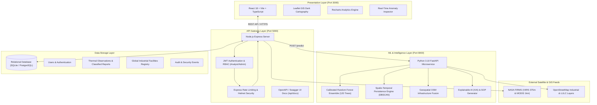

# PyroGuard AI - Architectural & System Design Specification

## 1. Executive Overview
PyroGuard AI is an advanced AI/ML-driven geospatial intelligence platform engineered to detect, classify, and continuously monitor industrial fires, routine operational flaring, and persistent thermal sources, while segregating them from natural wildfires, agricultural stubble burning, and sensor false alarms.

---

## 2. Core Problem Addressed
Satellite-based thermal fire radiometers such as **NASA FIRMS (VIIRS & MODIS)** detect thermal anomalies above background temperatures through medium-wave and long-wave infrared bands. However, existing satellite pipelines do not classify the source:
- A thermal anomaly of 400 MW at an oil refinery storage tank is an **acute industrial emergency** requiring instant plant shutdown and fire tender mobilization.
- A thermal anomaly of 40 MW at the same refinery flare stack is a **routine operational flaring emission** operating under an environmental permit.
- A thermal anomaly of 90 MW in a national park is a **forest wildfire** requiring wildland firelines.
- A thermal anomaly of 25 MW in farmland is **agricultural residue burning**.

PyroGuard AI fuses satellite telemetry, OpenStreetMap (OSM) infrastructure graphs, spatio-temporal persistence algorithms, and calibrated Machine Learning ensembles to bridge this critical gap.

---

## 3. High-Level System Architecture

---

## 4. Multi-Stage Classification Taxonomy

| Class Code | Category | Operational Meaning | Typical FRP Range | S-T Persistence | Proximity to Plant |
| :--- | :--- | :--- | :--- | :--- | :--- |
| `INDUSTRIAL_ACCIDENTAL_FIRE` | Industrial Emergency | Catastrophic explosion, tank fire, or chemical leak | 120 - 600+ MW | Low/Moderate prior, sudden spike | < 2.0 km |
| `INDUSTRIAL_PERSISTENT` | Routine Operational | Gas flaring stack, blast furnace, cracking unit | 15 - 85 MW | High (> 0.65) | < 1.5 km |
| `WILDFIRE` | Natural Hazard | Forest, woodland, or brush wildfire | 25 - 400+ MW | Low (moves) | > 10 km (in forest) |
| `AGRICULTURAL_BURNING` | Seasonal Biomass | Field crop residue / stubble burning | 5 - 55 MW | Low | In agricultural zone |
| `MINING_EXTRACTION` | Mining Hazard | Underground coal seam fire, mine spoil | 20 - 110 MW | Moderate/High | < 5.0 km (mine) |
| `OTHER_OR_FALSE_ALARM` | Noise / Reflection | Solar glint, hot pavement, sensor noise | 1 - 15 MW | Negligible | Any |

---

## 5. Spatio-Temporal Persistence Algorithm
The **Persistence Tracker** computes geographic recurrence:
$$\text{Persistence Index} = \min\left(1.0, \frac{N_{\text{detections}}}{N_{\text{baseline}}}\right)$$
Where $N_{\text{detections}}$ represents the number of satellite overpasses detecting thermal radiance at the same cluster centroid within a 1.0 km spatial radius over a 180-day sliding window.
- If an event exhibits $\text{Persistence} \ge 0.60$ and $\text{FRP} \le 90\text{ MW}$, it is tagged as **Stationary Industrial Operation**.
- If $\frac{\text{FRP}_{\text{current}}}{\text{Mean}(\text{FRP}_{\text{historical}})} \ge 2.5$ and $\text{FRP}_{\text{current}} > 120\text{ MW}$, it triggers an **Emergency Anomaly Surge Alarm**.

---

## 6. Security Model
- **Authentication**: Stateless HMAC-SHA256 JWT tokens with 7-day expiration.
- **Passwords**: One-way salted hashing with `bcryptjs` (work factor 10).
- **Authorization**: Role-Based Access Control (RBAC) separating `ANALYST` (review and update incident status) from `ADMIN` (user management, audit logs, system telemetry).
- **Hardening**: Helmet security headers, CORS origin whitelisting, parameterized SQL queries preventing SQL injection, and rate limiting (500 requests / 15 mins for general APIs, 50 requests / 10 mins for login).

